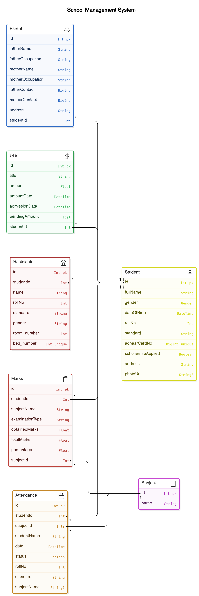

# Sacred Heart School ERP System

## Overview

Welcome to the School ERP System! for Sacred Heart. This project is designed to streamline school management tasks, including tracking student details, attendance, fees, hostel facilities, and marks. It features two access levels: admin and teacher, ensuring efficient management and data handling.

## Class Diagram


## Features

- **Student Management**: Track and manage student details, including personal information and academic records.
- **Attendance Tracking**: Monitor and record student attendance.
- **Fees Management**: Manage and track student fees, including payment status.
- **Hostel Management**: Oversee hostel facilities and student accommodation.
- **Marks Tracking**: Record and manage student marks and performance.
- **Role-based Access**: Separate access for admins and teachers to manage different functionalities.

## Setup

1. **Clone the repository**:
    ```bash
    git clone https://github.com/Sidhesh-02/schoolerp
    ```
2. **Install dependencies**:
    ```bash
    cd schoolerp
    npm install
    ```
3. **Run the project**:

    - For frontend:
        ```bash
        cd frontend
        npm install
        npm run dev
        ```
    - For backend:
        ```bash
        cd backend
        npm install
        npm start
        ```

## Contributing

If you want to contribute to the project, please follow these steps:

1. Fork the repository.
2. Create a new branch (`git checkout -b feature-branch`).
3. Make your changes.
4. Commit your changes (`git commit -am 'Add new feature'`).
5. Push to the branch (`git push origin feature-branch`).
6. Create a new Pull Request.

## License

This project is licensed under the MIT License - see the [LICENSE](LICENSE) file for details.

## Contact

For any inquiries or issues, please contact [here](sidheshcreates@gmail.com).

---

**Shout out to Harsh Dupare**

Thank you for checking out the School ERP System! 🎓
